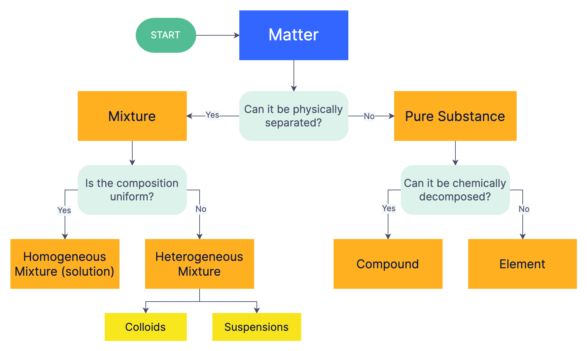

## Conditionals
When solving problems in the normal day-to-day, we rarely do the exact same actions every time regardless of the circumstance. For example, I may walk to school everyday, but depending if it is raining or not, I will bring an umbrella. Or, if my class is cancelled, I will sleep in on a Monday. If we did the same "program" regardless of the context, we wouldn't be able to solve all problems appropriately. This is where conditionals come in. They allow us to branch our program and make decisions as to what code gets ran each time.

## Conditional Statements and Booleans

We make decisions based on information everyday. If it is raining, we bring an umbrella. If I am hungry, I get food instead of water. If my car runs out of gas, I fill it up, if not I keep driving. All of these decisions are based on a question or statement that will be either true or false:

- Is it raining? / It is raining.
	- YES/True
		1. Get an umbrella
		2. Walk to school
	- NO/False
		- Walk to school
- Am I hungry? / I am hungry.
	- YES/True
		- Get Food
	- NO/False
		- Keep chilling
- Is my gas at empty? / My gas is empty.
	- YES/True
		- Seek gas station
	- NO/False
		- Continue driving

All complex decisions can be boiled down into YES/NO questions and/or True/False statements. Because of this, all programming languages design some method of evaluating boolean expressions or True-False statements, in order to make programs that can do different things based on input information. 

A boolean expression is a logical statement that can evaluate to either True or False. You probably have interacted with simple boolean expressions like the following:

- a < b - is a less than b?
- a > b - is a greater than b?
- a <= b - is a less than or equal to b?
- a >= b - is a greater than or equal to b?
- a == b - is a the same as b?
- a != b - are a and b different?

C implements these in the same way that you are used to for numerical data types:

-  90 < 1 -> False  
- 80 >= 80 -> True  
- 80 <= 80-> True  
- 52 < 52.1 -> True  
-  21 < 21 -> False
- 17 == 17.0 -> True
- 1 != 0 -> True

They also work on characters, however notice that the character of a number is different than the integer of the number:

- 'A' == 'a' -> False
- '$' != '&' -> True
- '@' == '@' -> True
- 'Z' > 'A' -> True
- '1' == 1 -> False
- '1' == 49 -> True

And of course, you may use variables in place of these numbers, meaning that your program can change functionality depending on user input.

!!! Note String Comparisons
	For now, do not attempt string comparisons. We will get there in due time, just know that, strings are stored differently than the other data types and needs to be handled in a special way. 

Boolean expressions are the same thing as mathematical expressions, just that they do not evaluate to some number, they evaluate to either a True or a False. You may notice something interesting with the BInary nature of boolean expressions. In fact, this is another reason why computers rely on a binary number system, True/False can be easily translated to 1/0. Not coincidentally, if you ran some of these expressions and printed them out as integers, you would see that the compiler stores True/False as 1/0:

```c
#include <stdio.h>

int main(){
	printf("%d", (10 < 11));
	// Prints 1
	printf("%d", (100 < 0));
	// Prints 0
	printf("%d", ('1' == 1));
	// Prints 0
	printf("%d", ('1' == 49));
	// Prints 1
	
	return 0;
}
```

## If-Else Statements

Now that we have a way to represent decision making at its most basic, we need to actually use it for something. If-Else statements are C's implementation of a branching path in a program. Given a boolean expression, the if-else statement will run a certain piece of code if the expression evaluates to true.

```c
if(boolean-expression){
	// Code ran if expression is true
	...
}
```

If the above boolean expression is evaluated to be false, nothing will happen. However, if one wants to have something specific happen if the expression is true and something else if it is false, the else statement can be used like so:

```c
if(boolean-expression){
	// Code ran if expression is true
	...
} else {
	// Code ran if the expression is false
	...
}
```

Using this we can do different things depending on user input:

```c
#include <stdio.h>

int main(){
	double temp_c;

	printf("Please enter the temperature outside:");
	scanf("%lf", &temp_c);

	if(temp_c < 0){
		printf("Brrrr! It is below freezing!\n");
	} else {
		printf("Above freezing!\n");
	}
	
	return 0;
}
```

You can also nest if-else statements:

```c
if(day == 'M'){
	if(time_hours < 12){
	
		printf("Monday is dragging so much!\n");

	} else {
		printf("At least halfway done!\n");

		if(work == 'F'){
			printf("And your work is finished!\n");
		}

	}
} 
```

You can also create chains of conditionals that will allow only a single path to execute. This is done using "else if"'s. If the boolean expression above an "else if" is false, the expression within itself will be evaluated. This allows you to check over a list of possible values:

```c
if(letter_grade == 'A'){
	printf("Passed with flying colors!");
} else if (letter_grade == 'B'){
	printf("Passed and did great!");
} else if (letter_grade == 'C'){
	printf("Meeting Exprectations.");
} else if (letter_grade == 'D'){
	printf("Not doing great, needs some work.");
} else if (letter_grade == 'F'){
	printf("Failing, something needs to change.");
} else {
	printf("Unknown letter.");
}
```

Notice that after all of the possible letter grades, we put a final else statement to catch the edge case that the variable "letter_grade" holds a symbol that we can't use. Also notice that only a single print statement will be ran from this piece of code since all the if-else's are chained to each other. If we wanted multiple boolean expressions that could be ran independent from other expressions we would do the following:

```c
if(magic_number % 2 == 0 ){
	printf("The magic number is even!");
} else {
	printf("The magic number is odd!");
}

if(magic_number < 17){
	printf("The magic number is less than 17!")
}

```

Here, the number can only be either even or odd, meaning only one can get printed. Regardless of that, the second if statement can be ran if the number is less than 17, even or odd.
## Matter Example

The following is an example of going from a flowchart, to an algorithm, to a program implementing it. Take note of how the conditional work to make a final classification of matter.



```c
/*
Program to Classify Matter
By: John Szwakob III

Description:
Using the flowchart the following algorithm and program was made to reflect its decision making process.

Algorithm:
	1. Start
	2. Print "Can the matter can be physically separated?"
	3. Store Y/N input
	4. If Y:
		1. Print "You have a mixture, is it a uniform composition?"
		2. Store Y/N input
		3. If Y:
			1. Print "The matter is a Homogeneous Mixture (solution)"
		4. If N:
			1. Print "The matter is a Heterogeneous Mixture; a Colloid or suspension."
	5. If N:
		1. Print "You have a Pure Substance, can it be chemically decomposed?"
		2. Store Y/N input
		3. If Y:
			1. Print "The matter is a compound."
		4. If N:
			1. Print "The matter is an element."
	6. End Program
*/

#include<stdio.h>

int main(){
	char input;

	printf("Hello! Welcome to the Matter Classifier!\n");
	printf("Can the matter can be physically separated?\n");
	scanf(" %c", &input);

	if(input == 'Y'){
	
		printf("You have a Mixture, is it a uniform composition?\n");
		scanf(" %c", &input);

		if(input == 'Y'){

			printf("The matter is a Homogeneous Mixture (solution)\n");

		} else if(input == 'N'){

			printf("The matter is a Heterogeneous Mixture; a Colloid or suspension.\n");

		}

	} else if(input == 'N'){
		printf("You have a Pure Substance, can it be chemically decomposed?\n");
		scanf(" %c", &input);
		if(input == 'Y'){

			printf("The matter is a Compound.\n");

		} else if(input == 'N'){

			printf("The matter is an Element.\n");

		}
	}

	return 0;
}
```


## Switch Statements

Often times, you will find yourself in a situation where you need to repeatedly check the same variable against many possible choices, for example if someone enters a letter and you want to check what letter they typed and do something specific based on it. This results in a long list of if-else if conditionals:

```c
char choice;

scanf("%c", &choice);

if(choice == 'a'){
	// Do choice A things
} else if(choice == 'b'){
	// Do choice B things
} else if(choice == 'c'){
	// Do choice C things
} else if ...{
} else {
	printf("Unknown choice!\n");
}
```

Jeez, that looks terrible. If only there was a way to get rid of all of those else-if's and curly braces. There is! Switch statements allow you to attend to different possible "cases" of a single variable. For example:

```c
char choice;

scanf("%c", &choice);

switch(choice){
	case 'a':
		//Do choice A things 
		break;
	case 'b':
		//Do choice B things
		break;
 	case 'c':
		//Do choice C things 
		break;
 	case 'd':
		//Do choice D things 
		break;
	default:
		// Undefined case things
}
```

This switch statement will do different things depending on the letter chosen by the user. I defined what values do what using the cases. When a case is entered, it will run the code beneath it until it reaches a break statement If no cases are reached the default case is ran, this is optional but helps out for when we want to handle all undefined cases the same way. 

!!! Are the break statements optional?
	Ultimately, yes they are optional from the compiler/computer's point of view. However, see what happens when we don't use them at the end of each case. Make a program similar to the one above, and add a print out to each case in the "//Do choice X things", including the default case. See what happens when you choose different options from your menu when you have the break statements vs when you don't.

