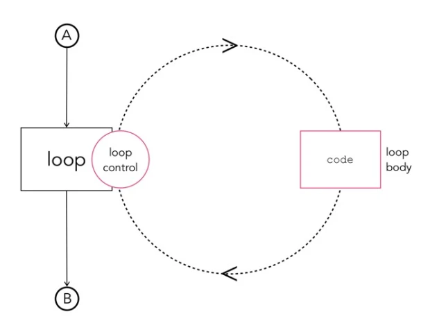
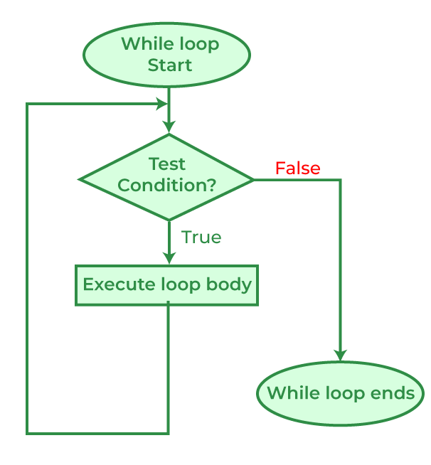
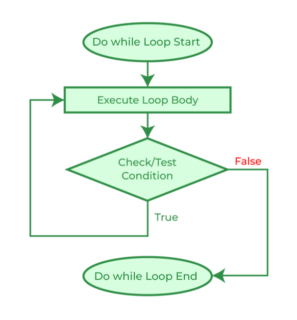
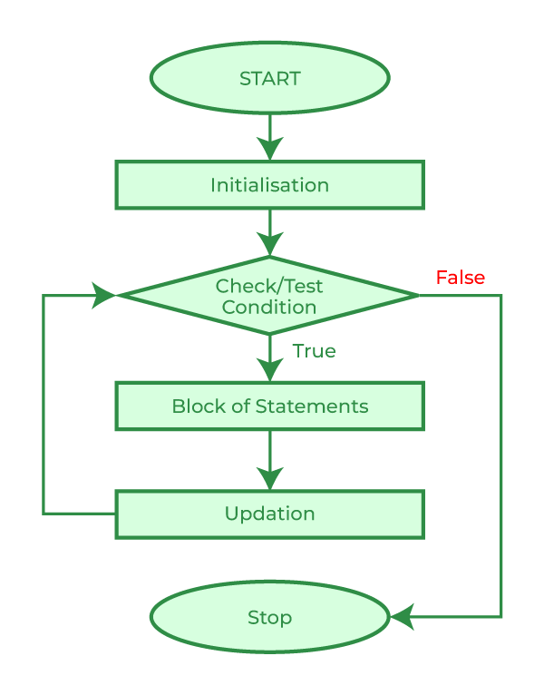

# While,  Do-While, and For Loops

Sometimes we will need to run pieces of code repeatedly, think about printing out all of the numbers between two user defined numbers. You can't just write a bunch of print statements because you don't know what numbers the user will choose. So your code will need to respond to the users input and run the print statement a certain number of times. This is a basic example of a possible use of loops. This section will go over the different kinds of loops at our disposal and how they work.

## Loops
The idea of a loop is to have a block of designated code that you want to loop over under certain circumstances. Those circumstances can be anything; until the loop has run X number of times,  until something happens in the program, or if some condition has been met. C gives us multiple ways to implement loops, the list being **while**, **do-while**, and **for loops**, each functioning slightly different. These differences make certain coding applications neater, however there are ways to convert the behavior of one into another as they all do the same thing under the hood.


The idea of an infinite loop will come up more than once when dealing with any programming now and well into the future. The danger of having a facility to run a block of code repeatedly leaves open ways to have huge errors in our code, ones that may halt our computer if we are not careful. Look out for ways that it could happen going forward.

## While Loops
```c
// Code before the loop
while(condition){
	// Code you want repeated while the condition is true

	// Update condition/end loop
}
// Code ran after the condition is read as false
```
While loops in C work like repeated if-statements. They are entered and evaluated like an if statement; when the while statement gets executed it checks the condition inside of itself, if true the code inside is ran, if false the code is skipped. However in the while loop, if the condition is true, after the code inside is ran it jumps back to the original while statement and checks the condition again. It will continue this loop until the condition is found to be false.


While loops give us the most direct way to implement an infinite loop, (1 is the same as true):
```c
while(1){
	printf("!!!   Oh No!   !!!");
}
```

!!!! note How to exit an accidental (or intentional) infinite loop
	Make a program that runs the above while loop. Your terminal will subsequently "freak out". In your panic you may think to close the terminal in order to stop the program, and most of the time this will be the case, however many times a program in the terminal will spin up background processes that will execute until their completion. To fully stop a program and not need to open a new terminal, press Control-C to "Cancel" the program. This will stop the process in a little bit of a cleaner fashion and not mess up your development flow. 

Later we will find out how to stop loops prematurely and use "infinite" loops to our advantage. But for now, let it be a lesson to double check that your loops will end. The example below shows a counter that will print out all of the numbers from 0 to 99. Because the condition is read like "while counter is less than limit" and the only update I do makes counter larger, the loop will always end no matter what value I pick for limit. 

```c
//while.c
#include <stdio.h>

int main(){
	int limit = 100;
	int counter = 0;

	while(counter < limit){
		printf("Current Count: %d\n", counter);
		counter++;
	}
	
	return 0;
}
```


Output:
```
[goodguy@magus-turrim ~]$ gcc while.c 
[goodguy@magus-turrim ~]$ ./a.out
Current Count: 0
Current Count: 1
Current Count: 2
Current Count: 3
Current Count: 4
...
Current Count: 99
[goodguy@magus-turrim ~]$
```

!!! note Replace counter++ with limit++
	To get an idea of a possible mistake you might make, see what happens when you make the change above. Think about what the computer is doing and why it gets stuck.

## Do-While Loops

```c
// Code before the loop

do {
	// Code you want ran at least once regardless of the condition
	// it will be ran again if the below condition is true
} while(condition);

// Code ran after the condition is read as false
```

Do-while loops work very similarly to while loops, but are ran once regardless of the condition and are repeated as long as the condition holds true. The difference really boils down to when the condition is evaluated. While loops check the condition first then enter its body, do-while first enter the body and then check to see if they should do it again.



Below is an example of a positive average calculator, where it will continue to ask the user for numbers until they enter a negative number:

```c
#include<stdio.h>

int main(){
	double input_num = 0;
	double sum;
	double avg;

	int counter = -1;

	do{
		sum += input_num;

		printf("Please enter a positive number (negative to exit):");
		scanf("%lf", &input_num);

		counter++;
	}while(input_num > -1);

	avg = sum / (float)counter; 

	printf("Average is: %lf\n", avg);
	
	return 0;
}
```

## For Loops

```c
// Code ran before the loop
for(initialization; condition; update){
	// Code you want repeatedly ran
}
// Code you want ran after the condition is false
```

The for loop is a very useful loop as it makes code a lot cleaner by allowing the programmer to include statements that are ran at different times in the looping process. Really there are five places of execution in a loop, they are:

1. Before entering the loop
2. The condition at start of each loop
3. The body of the loop
4. The end of each loop
5. After exiting the loop

For loops allow us to specify statements that we want ran:

- Before entering the loop
- The condition at start of each loop
- The end of each loop

all in one line, making code much cleaner. 


For example, say we wanted to make a loop that counted like [[#^efb7a8|the one earlier]] we needed a while loop that looked like this:

```c
int counter = 0;

while(counter < 100){
	printf("%d\n", counter);
	
	counter++;
}
``` 

If you notice, most of the code is just getting the looping behavior to work, with the actual repeated code taking up one line and the loop taking up at least four. Using for loops we can do the following:

```c
for(int counter = 0; counter < 100; counter++){
	printf("%d\n", counter);
}
```

Wow! That's a lot more compact and easily read, plus the compiler will automatically destroy that counter variable when the loop is exited, making it more memory safe and have a smaller footprint. 

Run the following for loop in a program and see what happens. It will run three times. After it stops take note of the order that things print out. Go all the way to the beginning of the print out and read what is up there. Notice the order in which things are executed. Ignore the break statement for now, it will come up in a later section.

```c
int i = 0;
for(printf("First entering loop\n"); printf("Start of each loop\n"); printf("End of each loop\n")){
	printf("Body of each loop\n");
	if(i > 3){
		break;
		}
	i++;
}
 printf("Exited loop\n);
```

## Nesting Loops

Like if statements, you can nest loops within one another. This allows us to write even less code sometimes, but opens up more possibilities to mess up. Looping loops can spiral out of control very fast. First a common example that will print out the numbers 1 - 25 in a 5x5 grid:

```c
//grid.c
#include<stdio.h>

int main(){
	int num = 1;
	
	for(int row = 0; row < 5; row++){
		for(int col = 0; col < 5; col++){
			printf("%d\t", num);
			num++;
		}
		printf("\n");
	}

	return 0;
}
```

Output:

```
[goodguy@magus-turrim ~]$ gcc grid.c && ./a.out 
1	2	3	4	5	
6	7	8	9	10	
11	12	13	14	15	
16	17	18	19	20	
21	22	23	24	25	
[goodguy@magus-turrim ~]$ 
```

Very useful right? Notice that I was able to run a block of code 5 x 5 = 25 times to make the grid. This means that if another loop was put into it it would run 5 x 5 x 5 = 125 times. This looping-calling-looping behavior needs to be watched and controlled because when we start dealing with large numbers of loops the computer will begin to slow down.

## Break/Continue

The last thing to talk about in loops are the **break** and **continue** statements. These two special statements can only be called within a block of code that is inside of a loop, and alters the normal flow of a loop. 

First, the break statement. It "breaks" out of the current loop regardless of how many times it has run or how many more loops it needs to go through.  Below is an example of a loop that will end once the count has reached a certain number:

```c
int num = 0;
while(1){

	if(num > 100){
		break;
	}

	printf("%d", num);
	num++;
}
```

Notice that the while loop would have normally ran infinitely, printing num until it overflowed the integer data type and then until the end of time. Break allows us to end a loop prematurely, or allows us to have multiple conditions that can end a loop.

Continue works a little differently, it ends the current iteration of the loop early and moves to the next. For example:

```c
for(int count = 0; count < 10; count++){
	printf("The number: %d\n", count);

	if(count % 2 == 1){
		continue;
	}

	printf("The number squared: %d\n", count*count);
}
```

Output:

```
[goodguy@magus-turrim ~]$ gcc continue.c && ./a.out 
The number: 0
The number squared: 0
The number: 1
The number: 2
The number squared: 4
The number: 3
The number: 4
The number squared: 16
The number: 5
The number: 6
The number squared: 36
The number: 7
The number: 8
The number squared: 64
The number: 9
[goodguy@magus-turrim ~]$
```

This program prints out every number 0-9 and will only print out the number squared if it is even. Notice that the loop doesn't end when the continue statement is ran, it just moves back to the condition and sees if it is still correct and continues normal behavior.
